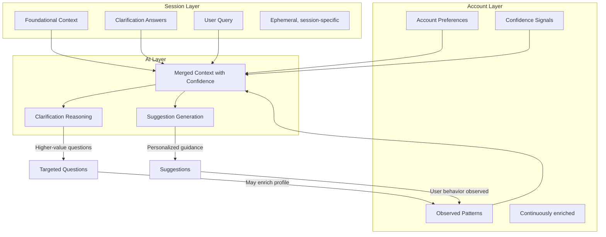

# Phase 9.1: AI-Account Context Integration

> **Status**: ✅ Complete (January 2026)  
> **Prerequisite**: Phase 9 (User Accounts & Authentication) ✅ Complete  
> **Roadmap**: See [roadmap.md](../roadmap.md) for timeline and context

## Overview

Transform the AI from a data collector into an interpreter by establishing a layered context model where account-level preferences inform session behavior and AI reasoning, enabling higher-value inquiry through confidence-based inference and continuous profile enrichment.

## Implementation Phases

| Phase | Description | Dependencies | Status |
|-------|-------------|--------------|--------|
| 9.1.1 | Extend account profile to store all foundational context fields with confidence metadata | — | ✅ Complete |
| 9.1.2 | Implement session context hydration from account profile with override support | 9.1.1 | ✅ Complete |
| 9.1.3 | Implement onboarding vs returning user flows with streamlined experience | 9.1.2 | ✅ Complete |
| 9.1.4 | Restructure AI prompts with layered context and confidence-based inference | 9.1.2 | ✅ Complete |
| 9.1.5 | Expand profile settings UI with all foundational fields and enrichment visibility | 9.1.1 | ✅ Complete |

---

## Phase 9.1.1 Implementation Summary (January 2026)

**Completed:**
- Extended `UserProfile` in `db.ts` with all foundational fields (`default_primary_goal`, `default_goal_timeline`, `default_life_stage`, `default_emergency_fund_status`)
- Added `ProfileMetadata` type for per-field confidence tracking (`ConfidenceLevel`, `ContextSource`, `FieldMetadata`)
- Extended `/api/user/profile` endpoint to support all new fields with validation
- Database migrations handle adding new columns to existing tables

**Files Modified:**
- `services/ui-web/src/lib/db.ts`
- `services/ui-web/src/app/api/user/profile/route.ts`
- `services/ui-web/src/types/budget.ts`

---

## Phase 9.1.2 Implementation Summary (January 2026)

**Completed:**
- Added `HydratedValue<T>` and `HydratedFoundationalContext` types for source tracking
- Created `lib/sessionHydration.ts` with hydration utilities (`hydrateFromAccountProfile`, `mergeSessionExplicit`)
- Extended `useBudgetSession` hook with auto-hydration on session start for authenticated users
- Updated `FoundationalQuestions` component to show "Saved" badges for hydrated fields
- Updated clarify page to pass hydrated context and show loading state during hydration

**Key Features:**
- **Precedence**: Session-explicit values override account-hydrated values
- **Source Tracking**: Each field knows if it came from account (`'account'`) or was set this session (`'session_explicit'`)
- **Visual Feedback**: "Using X saved preferences from your profile" header and per-field "Saved" badges
- **Backwards Compatibility**: Anonymous users and legacy sessions work unchanged

**Files Created:**
- `services/ui-web/src/lib/sessionHydration.ts`

**Files Modified:**
- `services/ui-web/src/types/budget.ts`
- `services/ui-web/src/hooks/useBudgetSession.tsx`
- `services/ui-web/src/components/FoundationalQuestions.tsx`
- `services/ui-web/src/app/(app)/clarify/page.tsx`

---

## Phase 9.1.3 Implementation Summary (January 2026)

**Completed:**
- Implemented condensed preferences view for returning users with substantial profiles (≥60% complete)
- Added toggle between condensed and expanded views with "Customize" action
- Implemented auto-advance logic for users with 100% complete profiles
- Polished first-time user onboarding with encouraging language and value proposition
- Added escape hatches in all flows (skip, customize, edit preferences)

**Key Features:**
- **Condensed View**: Compact 2-column grid showing 6 preferences with "Saved" badges and quick "Continue with these" action
- **Auto-Advance**: Users with fully complete profiles skip foundational step; can still access via "Edit preferences" link
- **Onboarding Mode**: First-time users see value proposition ("Better answers start with better context") and encouraging language
- **Escape Hatches**: All flows have clear skip/customize options; changes remain session-explicit

**Flow Differentiation:**

```
First-Time User (no profile):
  Query → Full Onboarding Form → Clarification Questions

Returning User (partial profile, <60%):
  Query → Full Onboarding Form (pre-filled) → Clarification Questions

Returning User (substantial profile, ≥60%):
  Query → Condensed "Confirm or Customize" View → Clarification Questions

Returning User (complete profile, 100%):
  Query → Auto-advance with "Edit preferences" escape hatch → Clarification Questions
```

**Files Modified:**
- `services/ui-web/src/components/FoundationalQuestions.tsx` — Condensed view, toggle logic, onboarding polish
- `services/ui-web/src/app/(app)/clarify/page.tsx` — Auto-advance logic, edit preferences link
- `services/ui-web/src/lib/foundationalQuestions.ts` — Added label helper functions

---

## Phase 9.1.4 Implementation Summary (January 2026)

**Completed:**
- Created `aiContextBuilder.ts` module for constructing confidence-aware AI prompt sections
- Implemented layered context builder with high/medium confidence sections
- Added tension detection between stated preferences and observed budget patterns
- Integrated account profile data into clarification and suggestion API routes
- Updated AI prompts to include layered context with confidence signals

**Key Features:**
- **Layered Context Sections**: `<user_profile source="account" confidence="high">`, `<session_context>`, `<observed_patterns>`, `<tensions>`, `<guidance>`
- **Tension Detection**: Identifies discrepancies like FIRE philosophy with low savings rate, aggressive risk tolerance with high-interest debt
- **Confidence Signals**: AI receives information about field staleness, source (explicit vs. inferred), enabling appropriate calibration
- **Observed Patterns**: Extracts savings rate, debt-to-income ratio, top expense categories from budget data

**Files Created/Modified:**
- `services/ui-web/src/lib/aiContextBuilder.ts` — New module with `buildLayeredContextString()`, `detectTensions()`, `extractObservedPatterns()`
- `services/ui-web/src/lib/ai.ts` — Updated to use layered context builder in prompts
- `services/ui-web/src/app/api/clarification-questions/route.ts` — Fetches account profile, passes to AI
- `services/ui-web/src/app/api/summary-and-suggestions/route.ts` — Fetches account profile, passes to AI

---

## Phase 9.1.5 Implementation Summary (January 2026)

**Completed:**
- Expanded profile settings UI (`/settings/profile`) to include all 7 foundational fields
- Added profile completeness indicator with progress bar (0-100%)
- Added "Why we ask" tooltips for each field explaining its impact on recommendations
- Auto-update `profile_metadata` when fields are saved (source: 'explicit', confidence: 'high', last_confirmed timestamp)
- Display source badges and last-confirmed timestamps for each field

**Key Features:**
- **Field Organization**: Grouped into logical sections (Goals & Planning, Financial Style, Life Situation)
- **Shared Definitions**: Reuses option definitions from `foundationalQuestions.ts` for consistency with session flow
- **Metadata Visibility**: Shows when and how each preference was set (explicit, onboarding, inferred)
- **Completion Tracking**: Visual progress indicator encouraging profile completion

**Files Created/Modified:**
- `services/ui-web/src/app/(app)/settings/profile/page.tsx` — Complete rewrite with all fields and metadata display
- `services/ui-web/src/app/api/user/profile/route.ts` — Auto-update profile_metadata on field saves
- `services/ui-web/src/lib/foundationalQuestions.ts` — Exported `WHY_WE_ASK`, added `OPTIMIZATION_FOCUS_OPTIONS`

---

## Vision

Transform the AI from a data collector into an interpreter. When a user has established preferences and context in their account, the AI should leverage that foundation to ask smarter, more targeted questions—advancing the user toward their goals rather than gathering information we already have. The account profile becomes a continuously enriched understanding of the user that grows smarter over time.

---

## Problem Statement

Users currently repeat themselves across multiple touchpoints:

- During deterministic onboarding (foundational questions)
- In their account profile settings
- When AI asks clarification questions

This creates friction, signals that the system doesn't "know" them, and wastes interaction budget on low-value data collection instead of high-value interpretation.

---

## Design Principles

### 1. The Context Model

The system operates with three layers of user context, each with distinct characteristics:

| Layer | Persistence | Source of Truth | Nature |

|-------|-------------|-----------------|--------|

| **Account Context** | Durable (persists across sessions) | User's explicit settings + observed patterns | Continuously enriched preferences |

| **Session Context** | Ephemeral (this analysis only) | Foundational questions + clarification answers | Confirmed or refined for this situation |

| **AI Context** | Transient (per-request) | Merged view for prompt construction | What the AI reasons over, with confidence signals |

### 2. Precedence and Trust

**Principle: Session-explicit > Account-stored > Inferred**

- If the user explicitly sets a value *this session*, it takes precedence over their account default
- Account defaults are treated as "likely true" background with varying confidence levels
- Inferred values (from behavior, budget patterns, or AI reasoning) have lowest precedence but can inform questions

**Principle: Confidence increases through corroboration**

- A preference stated once is provisional; a preference confirmed across multiple sessions or corroborated by behavior is high-confidence
- Conflicting signals (stated preference vs. observed behavior) should trigger soft revalidation, not silent assumptions
- The system should distinguish between "user said this" and "user consistently demonstrates this"

### 3. Mutability Rules

| Context Type | When Mutable | By Whom |

|--------------|--------------|---------|

| Account defaults | Anytime via profile settings | User explicitly |

| Account context (enriched) | Continuously, through interactions | System with user visibility |

| Session foundational context | During foundational questions step | User explicitly |

| Session clarification answers | During clarification step | User explicitly |

**Principle: Account context flows into sessions but sessions don't silently update accounts**

A user's session-specific choices (e.g., "I'm focused on debt payoff for THIS budget") shouldn't automatically overwrite their general profile defaults. However, the system may *propose* updates when patterns emerge ("You've focused on debt payoff in your last 3 analyses—would you like to make this your default?").

### 4. Continuous Enrichment Model

The account profile is not a static snapshot—it is a continuously enriched understanding of the user that grows smarter over time.

**Sources of enrichment** (ordered by confidence):

1. Explicit profile settings (highest confidence)
2. Onboarding responses (high confidence)
3. Clarification answers that recur across sessions (medium-high confidence)
4. Calculator usage patterns and scenario choices (medium confidence)
5. AI-observed budget patterns (lower confidence, used to inform questions rather than assume answers)

**Freshness through signals, not schedules**:

- Rather than prompting "review your profile every 6 months," the system watches for signals that preferences may have changed
- Examples: life stage mismatch with age progression, goal timeline that has passed, budget patterns that contradict stated philosophy
- When signals emerge, the AI can gently probe: "Your profile mentions early-career focus, but your income pattern suggests you may be further along—has your situation changed?"

**Tradeoff**: This approach requires tracking more nuanced context than simple key-value preferences. Implementation should start with the explicit/onboarding layer and extend to observed enrichment in later phases.

---

## Onboarding vs. Ongoing Experience

### First-Time Users: Intentional Baseline Establishment

New users go through an intentional onboarding flow that establishes their account profile baseline:

- **Structured flow**: Foundational questions presented as a coherent onboarding experience, not scattered data collection
- **Reasonable optionality**: All questions are skippable, but the UI communicates value and encourages completion
- **Deferred inputs**: Non-essential preferences can be skipped initially and filled later as they become relevant
- **Profile completeness signal**: Show users how complete their profile is and what benefits come from fuller profiles

**Goal**: After onboarding, the system has enough baseline context to provide personalized experiences immediately.

### Returning Users: Streamlined with Incremental Enrichment

Subsequent sessions for authenticated users default to a streamlined experience:

- **Leverage existing context**: Session is hydrated from account profile; foundational questions are skipped or shown as a quick "confirm or customize" summary
- **Incremental enrichment**: The system learns more with each interaction—new preferences, refined understanding, observed patterns
- **Targeted questions for meaningful gaps**: If a gap meaningfully affects recommendation quality, the AI asks about it; otherwise, it proceeds with reasonable defaults

**Flow evolution**:

```
Session 1 (onboarding):  Full foundational questions → rich baseline established
Session 2:               Confirm or customize summary → AI-driven clarification
Session 3+:              Direct to AI clarification → profile silently enriched
Exception:               Major gap detected → targeted foundational question surfaces
```

### Edge Cases

- **User clears profile**: Returns to onboarding-like state
- **User changes life stage significantly**: System detects signal mismatch, triggers soft revalidation
- **Anonymous session**: No account context; falls back to full foundational flow stored in session only

---

## AI Framing: Confidence-Based Inference and Inquiry Elevation

### The Wrong Mental Model

> "If we know their financial philosophy, don't ask about it."

This reduces the AI to a question-skipper. It's correct but insufficient.

### The Right Mental Model

> "Given what we know about this user and our confidence in that knowledge, what questions would *advance* their situation rather than *document* it?"

When the AI knows someone follows the r/personalfinance approach, instead of asking "What's your philosophy?", it can ask:

- "You've mentioned prioritizing debt payoff—does your current debt situation align with that, or has something changed?"
- "Given your focus on the Prime Directive, would you like suggestions framed around that flowchart?"

### Confidence-Based Inference

The AI should be able to act on accumulated knowledge while respecting user agency:

**When confidence is high** (explicit setting + behavioral corroboration):

- The AI can proceed on the assumption without confirmation
- Inform the user when preferences are being applied: "Based on your FIRE focus, I'm prioritizing savings rate recommendations"
- No confirmation required unless the user's query suggests a different direction

**When confidence is medium** (stated but not recently confirmed):

- The AI can act on the assumption but should remain open to correction
- Frame recommendations with soft attribution: "Given your stated preference for aggressive saving..."
- Watch for signals that might indicate the preference has shifted

**When confidence is low** (inferred from patterns, never explicitly stated):

- Use to inform questions, not to assume answers
- The AI might ask: "Your budget suggests debt payoff is a priority—is that accurate?"
- Never bypass user input based solely on inference

**When signals conflict** (stated preference vs. observed behavior):

- Surface the tension rather than assuming either is correct
- Example: "Your profile says 'aggressive saver,' but your current savings rate is 3%. Would you like help closing that gap, or has your situation changed?"

### Avoiding Over-Confirmation

Excessive "is this still right?" prompts create cognitive load and friction. Reserve explicit confirmation for:

- **High-impact decisions**: Recommendations that would significantly change behavior
- **Ambiguous situations**: When the user's query could reasonably go multiple directions
- **Detected conflicts**: When stated preferences and observed behavior diverge

For routine interactions with high-confidence context, proceed without re-asking.

### Prompt Design Principles

1. **Provide context as background, not constraints**

   - Good: "The user has indicated they follow the FIRE philosophy and have moderate risk tolerance."
   - Bad: "DO NOT ask about philosophy or risk tolerance."

2. **Include confidence signals**

   - Let the AI know what's high-confidence (explicit + confirmed) vs. provisional (stated once)
   - This enables appropriate calibration of when to assume vs. when to probe

3. **Frame known context as a starting point for deeper inquiry**

   - The AI should use known context to ask *better* questions, not just *fewer* questions
   - Questions should probe gaps, tensions, or opportunities—not re-collect basics

4. **Distinguish "known" from "confirmed this session"**

   - Let the AI know what's from the account vs. what the user just said
   - This enables appropriate confidence calibration

5. **Avoid rigid filtering in prompts**

   - Don't programmatically strip questions post-generation based on field IDs
   - Trust the AI to reason over context; provide good context and let it decide

### Example Prompt Structure

```
<user_profile source="account" confidence="high">
The user has established the following preferences in their account:
- Financial Philosophy: FIRE movement (confirmed across 3 sessions)
- Risk Tolerance: Aggressive (explicitly set in profile)
- Primary Goal: Early retirement (set during onboarding)
- Life Stage: Mid-career (set 8 months ago)

These preferences are well-established. Act on them unless the user's current query suggests otherwise.
</user_profile>

<user_profile source="inferred" confidence="medium">
Observed patterns suggest:
- High savings rate priority (budget shows 35% savings rate)
- Debt-averse (no debt accounts in recent budgets)

These are inferences from behavior. Use to inform questions, not to assume preferences.
</user_profile>

<session_context>
This session, the user has confirmed or provided:
- Goal Timeline: Medium-term (3-10 years)
- Query: "How can I increase my savings rate?"
</session_context>

<guidance>
Given the user's established context and confidence levels:
- Their FIRE focus and high savings rate suggest the query aligns with their established preferences
- Focus on actionable strategies rather than re-establishing preferences
- If you detect any tension between their query and their profile, surface it gently
- Probe for gaps that would enable more precise recommendations (e.g., specific savings targets, timeline details)
</guidance>
```

---

## Risks and Mitigations

### Risk: Profile Drift Without Awareness

User's circumstances may change gradually. The profile might become stale without any single triggering event.

**Mitigation**:

- Watch for signal mismatches rather than relying on time-based refreshes
- AI can surface gentle probes when patterns diverge: "Your profile mentions X, but your recent budgets suggest Y—has something changed?"
- Provide "Profile health" visibility in settings showing when preferences were last confirmed/updated
- Avoid hard prompts; favor contextual, in-flow revalidation when relevant

### Risk: Over-trusting Inferred Data

The system might act on behavioral inferences that don't reflect actual preferences.

**Mitigation**:

- Inferences inform questions, never bypass user input
- Distinguish explicitly in prompts between "user stated" and "system inferred"
- When inferences drive recommendations, attribute them: "Based on your recent budget patterns..."
- Allow users to see and correct inferred preferences

### Risk: Intent Drift Within a Session

User's goal for *this* session may differ from their general profile or even from what they started the session with.

**Mitigation**:

- Session context always overrides account context for explicit choices
- The user query (what they're asking about) heavily weights the interaction
- AI should remain responsive to signals that the user's focus has shifted mid-session
- Never assume the account profile is the complete picture for this session

### Risk: Friction from Visible Enrichment

Users might find it unsettling if the system "knows too much" without them having explicitly told it.

**Mitigation**:

- Transparency about what's inferred vs. stated
- Inferred preferences shown as suggestions, not facts: "We noticed..." not "Your preference is..."
- Easy dismissal/correction of inferences
- User control over whether behavioral enrichment is enabled

### Risk: Onboarding Fatigue for New Users

Full foundational questions might overwhelm new users, leading to abandonment.

**Mitigation**:

- Clear skip affordances at every step
- Communicate immediate value: "Answer this to get better recommendations"
- Allow deferred completion: "You can set this later in your profile"
- Consider progressive onboarding: essential questions first, optional questions surfaced when relevant

---

## Solution Architecture



---

## Implementation Approach

### Phase 9.1.1: Context Model Foundation

**Goal**: Establish the account profile as a richer data structure capable of storing all foundational context types with confidence metadata.

**Scope**:

- Extend account profile storage to include all foundational fields
- Add confidence/source metadata (explicit vs. inferred, last confirmed date)
- Create API support for full profile CRUD
- Ensure backward compatibility with existing profiles

### Phase 9.1.2: Session Hydration

**Goal**: When a session begins, pre-populate session context from account profile with clear precedence rules.

**Scope**:

- Implement hydration logic (account → session, with explicit overrides preserved)
- Add UI indicators for "using saved preference" fields with easy override
- Track which preferences were hydrated vs. explicitly set this session

### Phase 9.1.3: UI Flow Optimization

**Goal**: Differentiate onboarding from returning user experience.

**Scope**:

- First-time users: Intentional onboarding flow that establishes baseline
- Returning users: Streamlined "confirm or customize" summary instead of full foundational questions
- Auto-advance when profile is substantially complete
- Provide escape hatch to fully customize

### Phase 9.1.4: AI Prompt Enhancement

**Goal**: Reframe AI prompts to leverage layered context with confidence signals.

**Scope**:

- Restructure prompts with confidence-tagged context sections
- Frame account data as background with varying confidence levels
- Guide AI toward inquiry elevation: better questions, not just fewer
- Enable AI to surface tensions and probe meaningfully
- Test with varied user profiles to ensure quality improvement

### Phase 9.1.5: Profile Settings Expansion

**Goal**: Give users full control and visibility over their evolving profile.

**Scope**:

- Expand profile settings UI to include all foundational fields
- Show confidence/source metadata where relevant
- Add explanatory text about how each field affects recommendations
- Consider "Profile health" indicator showing enrichment status

---

## Success Criteria

### User Experience Outcomes

1. **Reduced friction**: Returning users spend significantly less time on data entry than first sessions
2. **Personalization signal**: Users perceive that the system "knows" them and improves over time
3. **Appropriate agency**: Users feel informed when preferences are applied, not bypassed
4. **Easy correction**: When account data doesn't match current intent, users can override without friction
5. **Onboarding completion**: First-time users complete enough profile to enable personalization

### AI Behavior Outcomes

1. **Inquiry elevation**: With richer context, AI asks more targeted, higher-value questions
2. **Confidence-appropriate inference**: AI acts decisively on high-confidence data, probes appropriately on lower-confidence data
3. **Tension surfacing**: When budget data contradicts stated preferences, AI addresses the discrepancy constructively
4. **Goal advancement**: Questions focus on what's needed to give *this* user good advice, not generic data collection

### Measurement Approach

- Compare question counts and quality for users with/without complete profiles
- Track override frequency (are we pre-filling appropriately?)
- Monitor profile enrichment over time (is the system learning?)
- Gather qualitative feedback on personalization perception and appropriate agency
- Measure onboarding completion rates and time-to-first-insight

---

## Files Likely Affected

The following areas will require changes. Specific file-level implementation will be determined during execution:

| Area | Nature of Change |

|------|------------------|

| Account profile data model | Extend to include all foundational fields with confidence metadata |

| Profile API | Support full field set with validation and source tracking |

| Session initialization | Hydrate from account profile when authenticated |

| Foundational questions UI | Differentiate onboarding vs. returning user flows |

| Clarification page flow | Streamline for users with complete profiles |

| AI prompt construction | Restructure with layered context and confidence signals |

| Profile settings page | Expand to all foundational fields with enrichment visibility |

---

## Related Documentation

- [**roadmap.md**](../roadmap.md) — Product roadmap with Phase 9.1 overview and timeline
- [**ai_questioning_spec.md**](../ai_questioning_spec.md) — MVP clarification behavior (extended by this phase)
- [**persistence_layer.md**](persistence_layer.md) — Database models including User and UserProfile
- [**security.md**](../security.md) — Authentication and data privacy requirements
- [**budget_schema.md**](../budget_schema.md) — Unified budget model that receives clarification answers